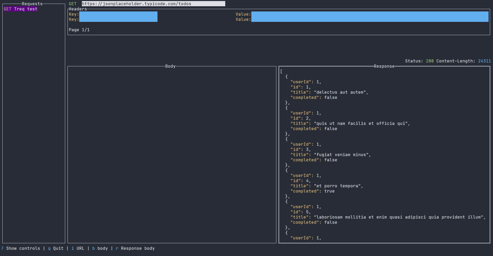

# treq 🦖

Make HTTP requests from your terminal, and save them with an embedded sqlite datababase.

# How to use

## From source

⚠️ Checksum verification is on its way, always be sure what .exe you are executing in your machine.
I recommend to build/execute from source using golang 1.22 and cloning or forking the repo.

## From releases

1. Go to the [releases](https://github.com/lucaspiritogit/treq/releases) page and download the latest package of your OS.
2. Use the `treq.exe` program from a terminal to open up **treq**

## Where is the DB saved?

Depending on your OS, the sqlite db is saved on these locations:

### Linux / Unix-like

Path: $XDG_CONFIG_HOME or ~/.config if XDG_CONFIG_HOME is not set.
Example: `/home/username/.config`

### Windows

Path: %AppData% (usually `C:\Users\username\AppData\Roaming`)
Example: `C:\Users\username\AppData\Roaming`

### macOS

Path: $HOME/Library/Application Support
Example: `/Users/username/Library/Application` Support

# Contributing

As of right now, treq is still a WIP, so the code can be messy at times. If you stumble upon this project and want to contribute, open a PR to the `main` branch so i can take a look.

# Roadmap

- Real contribution guidelines
- Organize the code so its easier to contribute
- QA
- Themes
- Assure it works con all OS
- More response metadata
